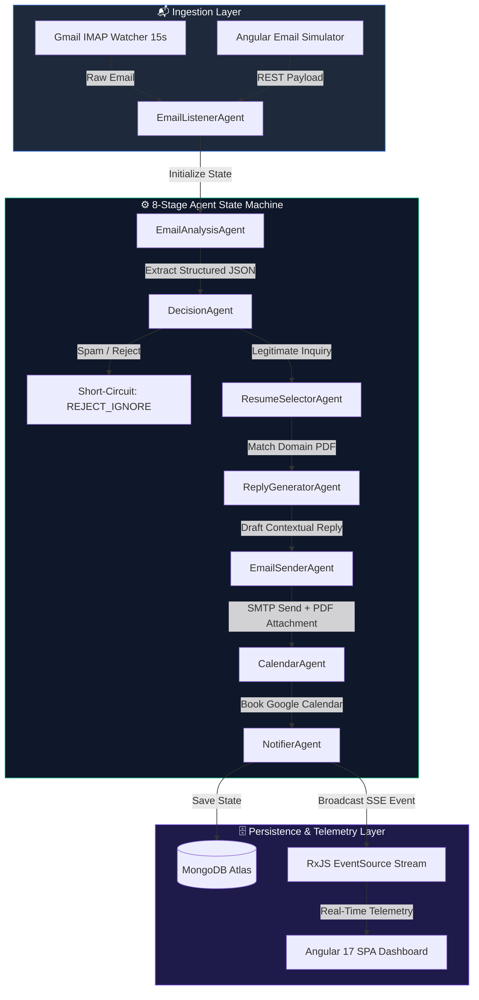
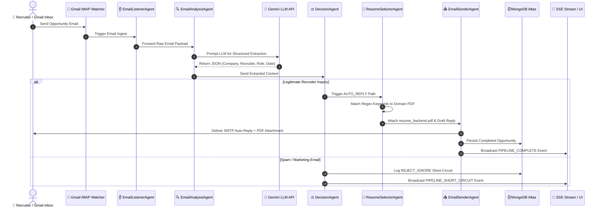
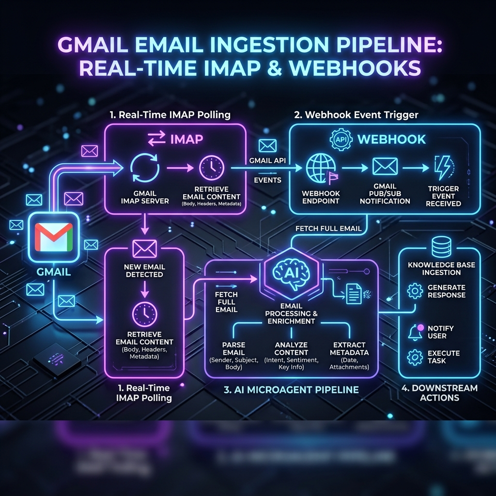
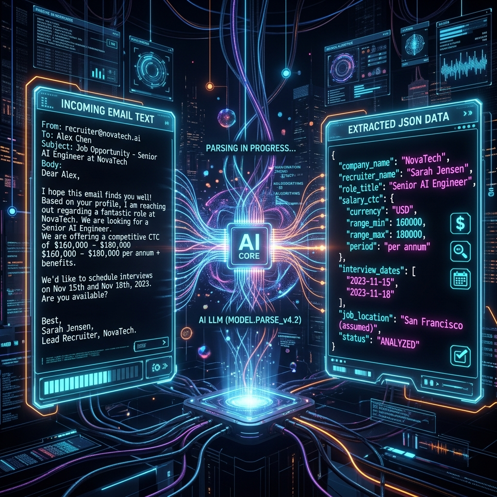
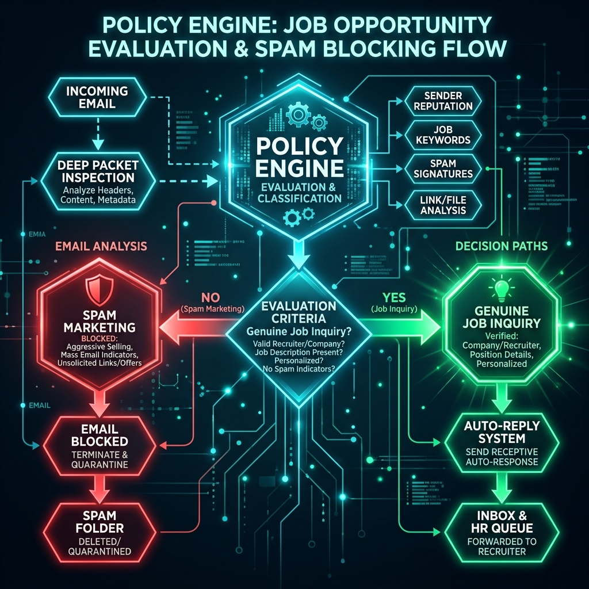
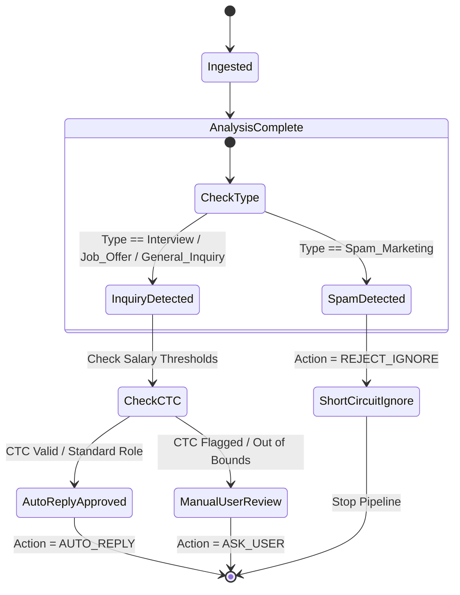
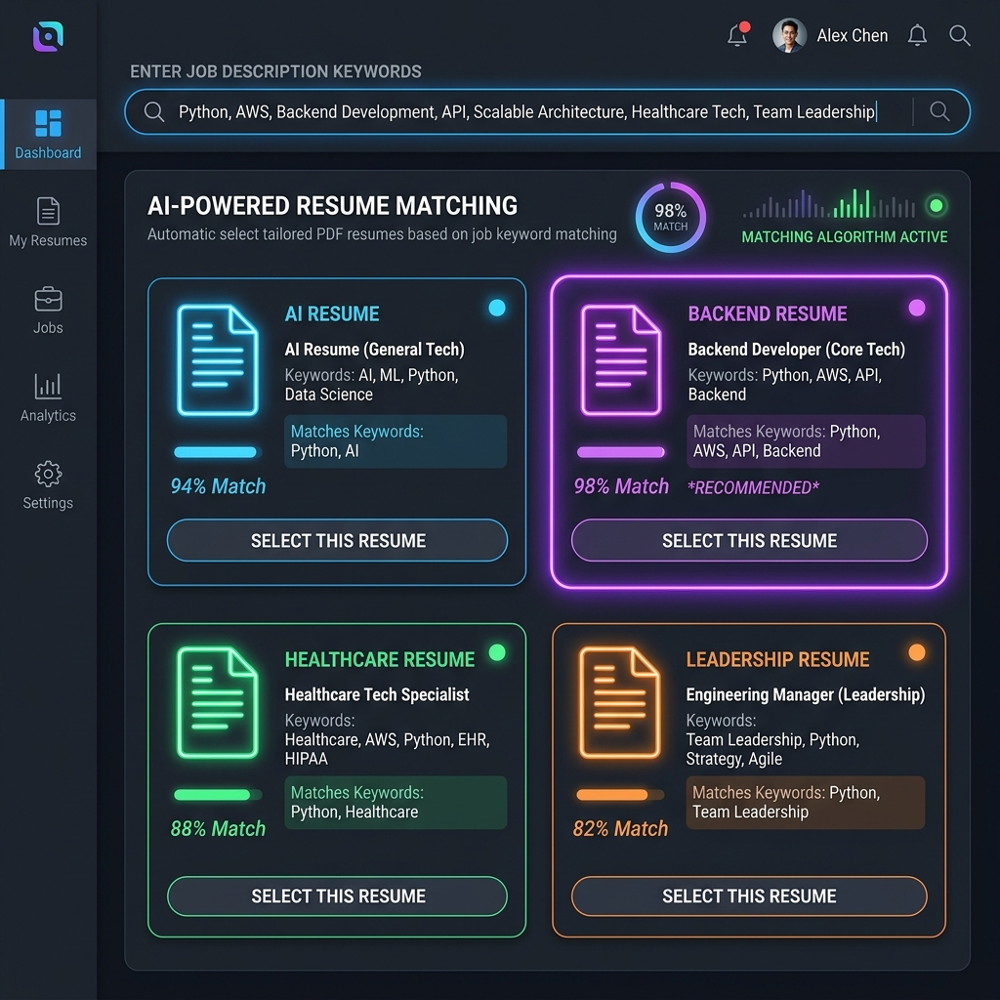
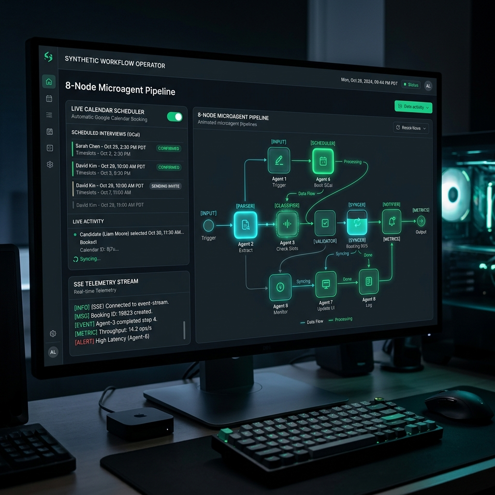
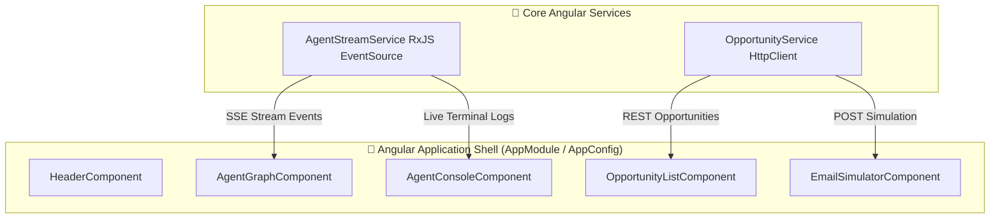

# 🧠 Technical Architecture & Code-Level Deep Dive

> [!NOTE]
> This document provides a comprehensive code-level architectural breakdown of the **AI Job Opportunity Agent**. It covers the event-driven micro-agent state machine, data schemas, LLM prompt engineering, fallback resilience, step-by-step visual diagrams, and the Angular 17 SPA integration.

---

## 📐 1. System Architecture Overview

The system operates as an **Event-Driven Micro-Agent State Machine**. Incoming email events from the Gmail IMAP Watcher or HTTP Workbench trigger an automated, multi-stage pipeline.



---

## 🔄 2. End-to-End Sequence Workflow

The sequence diagram below illustrates the exact execution path and inter-agent communication when a recruiter email arrives.



---

## 🤖 3. Step-by-Step Micro-Agent Visual Breakdown

Below is the code-level analysis, data transformation, and visual architecture diagram for each step in the pipeline.

---

### Step 1: Real-Time Gmail Ingestion & Listener Agent
- **Source File**: [`agents/listener.agent.ts`](file:///Users/uday/Documents/AI/job-opportunity-agent/agents/listener.agent.ts)
- **Role**: Entry point for email ingestion. Initializes unique opportunity IDs and logs the starting telemetry state.



```typescript
export class EmailListenerAgent {
  static ingest(rawPayload: RawEmailPayload): WorkflowState {
    const opportunityId = `opp_${Date.now()}_${Math.random().toString(36).substring(2, 7)}`;
    return {
      opportunityId,
      rawPayload,
      status: 'INGESTED',
      logs: [`[Agent: EmailListenerAgent] Ingested payload from ${rawPayload.from}`],
      createdAt: new Date()
    };
  }
}
```

---

### Step 2: Email Analysis & LLM Metadata Extraction
- **Source File**: [`agents/analyzer.agent.ts`](file:///Users/uday/Documents/AI/job-opportunity-agent/agents/analyzer.agent.ts)
- **Role**: Invokes Gemini LLM to convert raw body text into structured JSON metadata.



> [!TIP]
> **Recruiter Name Extraction Algorithm**:
> To prevent candidate greetings (e.g., `Hi Uday,`) from incorrectly overwriting `recruiterName`, the analyzer uses a 3-tier regex parser:
> 1. **Bottom Sign-Off**: Checks sign-offs (`Best, Sarah`, `Regards, John`, `Thanks, Alex`).
> 2. **From Header**: Extracts display name (`"Jane Smith" <jane@techcorp.com>`).
> 3. **Sanitized Prefix**: Extracts sanitized email username (`jane.smith`).

---

### Step 3: Policy Engine & Spam Filtration
- **Source File**: [`agents/decision.agent.ts`](file:///Users/uday/Documents/AI/job-opportunity-agent/agents/decision.agent.ts)
- **Role**: Evaluates policy rules and decides the pipeline path (`AUTO_REPLY`, `ASK_USER`, `REJECT_IGNORE`).





---

### Step 4: Resume Selection & Domain PDF Matching
- **Source File**: [`agents/resume-selector.agent.ts`](file:///Users/uday/Documents/AI/job-opportunity-agent/agents/resume-selector.agent.ts)
- **Role**: Matches domain keywords against candidate PDF resume categories using strict word-boundary regex (`\bkeyword\b`).



| Domain Category | Regex Trigger Keywords | Output Resume File |
| :--- | :--- | :--- |
| **AI / Machine Learning** | `AI`, `Machine Learning`, `LLM`, `Deep Learning`, `Python`, `PyTorch` | `resume_ai.pdf` |
| **Backend / Distributed** | `Node.js`, `TypeScript`, `Golang`, `Backend`, `Microservices` | `resume_backend.pdf` |
| **Healthcare / Biotech** | `Healthcare`, `Biotech`, `Clinical`, `HIPAA`, `Medical` | `resume_healthcare.pdf` |
| **Leadership / Executive** | `Lead`, `Architect`, `Director`, `Manager`, `VP`, `Head` | `resume_leadership.pdf` |

---

### Step 5 & 6: Reply Generation & Gmail SMTP Delivery
- **Source Files**: [`agents/reply-generator.agent.ts`](file:///Users/uday/Documents/AI/job-opportunity-agent/agents/reply-generator.agent.ts) & [`agents/email-sender.agent.ts`](file:///Users/uday/Documents/AI/job-opportunity-agent/agents/email-sender.agent.ts)
- **Role**: Prompts Gemini LLM to construct a personalized email under 100 words and dispatches it via Nodemailer SMTP with the attached PDF resume.


---

### Step 7 & 8: Calendar Booking & Angular Dashboard Telemetry
- **Source Files**: [`agents/calendar.agent.ts`](file:///Users/uday/Documents/AI/job-opportunity-agent/agents/calendar.agent.ts) & [`agents/notifier.agent.ts`](file:///Users/uday/Documents/AI/job-opportunity-agent/agents/notifier.agent.ts)
- **Role**: Detects proposed interview schedules, books Google Calendar slots, persists to MongoDB Atlas, and streams SSE execution telemetry to the Angular UI dashboard.



---

## 🎨 4. Angular UI Component Architecture

The frontend is an Angular 17 Single Page Application (SPA) structured with dedicated standalone components:



---

## 🛡️ 5. Resiliency & Fallback Matrix

> [!WARNING]
> Production environments face API rate limits and network degradation. The system implements transparent fallbacks for high availability:

| Failure Scenario | Secondary Fallback Strategy | Resulting Status |
| :--- | :--- | :--- |
| **Gemini API 429 Rate Limit** | Automatically switches to deterministic Mock LLM Engine | `SUCCESS` (No pipeline interruption) |
| **MongoDB Atlas Offline** | Transparently switches to In-Memory Repository Array | `SUCCESS` (Zero request loss) |
| **Invalid Email Address / Bounce** | Suppresses auto-reply to `mailer-daemon` addresses | `REJECTED` (Prevents loops) |
| **IMAP Socket Disconnect** | Auto-reconnects with exponential backoff every 15s | `ACTIVE` (Continuous background monitoring) |
